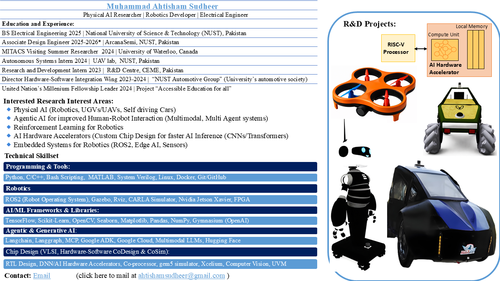

<h1 align="center"> 👋 Hi, I'm Muhammad</h1>

- 📖 I'm an Electrical Engineering Student at the National University of Science and Technology (NUST), Pakistan.

  

- ⚡ Passionate about building intelligent systems specifically in Physical AI in the subfield of edgeAI, robotics, autonomous vehicles, Deep Neural Network Accelerator Designs (AI Hardware Accelerator Design in Chip Design Domain), Hardware Software CoDesign and CoSimヾ(≧ ▽ ≦)ゝ
  
- ✨ Leveraging my research and expertise, I am dedicated to fostering innovation and enhancing global connectivity (●'◡'●)
  
- 🔭 I’m looking forward to collaborate on ANYTHING! ༼ つ ◕_◕ ༽つ 

## Favourite Languages & Tools

  
  
  
  
  
  
  
  
  
  
  
  
  

## Contact Details
<a href="mailto:ahtisham7340700@google.com?Subject=Hello%20User"> 
<!---

--->

